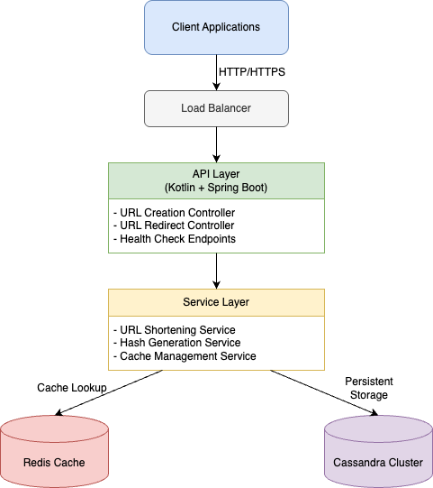

# KUS - Kotlin URL Shortener

A modern URL shortening service built with Kotlin and Spring Boot, designed for high performance and scalability.

## 🚀 Features

- URL shortening with custom hash generation
- High-performance caching with Redis
- Persistent storage with Apache Cassandra
- RESTful API endpoints
- Containerized deployment with Docker
- Comprehensive test coverage

## 🛠️ Tech Stack

- **Language:** Kotlin 1.9.22
- **Framework:** Spring Boot 3.2.0
- **JDK Version:** Java 21
- **Database:** Apache Cassandra
- **Cache:** Redis
- **Build Tool:** Maven
- **Containerization:** Docker & Docker Compose
- **Testing:**
  - JUnit 5
  - Mockito
  - Testcontainers

## 🏛️ Architecture & Design Decisions

### System Architecture



### Key Design Decisions

1. **Two-Tier Storage Strategy**
   - Redis as primary cache for fast URL lookups
   - Cassandra as persistent storage
   - Rationale: Optimizes for read performance while ensuring data durability

2. **Cassandra as Primary Database**
   - Pros:
     - Horizontal scalability for large URL datasets
     - High write throughput for URL creation
     - No single point of failure
   - Cons:
     - Eventually consistent (mitigated by cache layer)
     - More complex setup compared to traditional RDBMS

3. **Redis Caching Layer**
   - Pros:
     - Sub-millisecond response times for URL lookups
     - Reduces database load
     - Built-in TTL support for URL expiration
   - Cons:
     - Additional infrastructure component to maintain
     - Memory constraints for very large datasets

4. **Kotlin & Spring Boot**
   - Pros:
     - Type safety and null safety
     - Coroutines support for async operations
     - Mature ecosystem and excellent Java interoperability
   - Cons:
     - Learning curve for teams more familiar with Java
     - Smaller community compared to Java

### Performance Considerations

- URL hash generation optimized for uniqueness and speed
- Aggressive caching strategy to minimize database hits
- Connection pooling for both Redis and Cassandra
- Asynchronous logging to prevent I/O bottlenecks

### Security Measures

- Rate limiting on API endpoints
- Input validation and sanitization
- No sensitive information in shortened URLs
- Protection against enumeration attacks

### Scalability Approach

- Horizontally scalable application layer
- Distributed caching with Redis
- Cassandra's built-in partitioning for data distribution
- Stateless application design for easy scaling

## 📋 Prerequisites

- Java 21 or higher
- Maven
- Docker and Docker Compose
- Make (optional, for using Makefile commands)

## 🏗️ Project Structure

```
kus/
├── src/
│   ├── main/kotlin/      # Main application code
│   └── test/kotlin/      # Test files
├── docker/
│   ├── docker-compose.yml
│   ├── Dockerfile
│   └── cassandra-init.cql
└── pom.xml              # Maven configuration
```

## 🚀 Getting Started

1. Clone the repository:
   ```bash
   git clone https://github.com/yourusername/kus.git
   cd kus
   ```

2. Start the infrastructure (Cassandra and Redis):
   ```bash
   docker-compose -f docker/docker-compose.yml up -d
   ```

3. Build the application:
   ```bash
   mvn clean package
   ```

4. Run the application:
   ```bash
   mvn spring-boot:run
   ```

## 🔧 Configuration

The application can be configured through the following files:
- `application.properties` or `application.yml` for Spring Boot configuration
- `docker-compose.yml` for container configuration
- `cassandra-init.cql` for database initialization

## 🧪 Running Tests

```bash
mvn test
```

The project uses Testcontainers for integration testing, ensuring that tests run against real instances of Cassandra and Redis in isolated containers.

## 📝 API Documentation

The API is documented using OpenAPI 3.0.3 specification. The complete API documentation can be found in `docs/api.yaml`.

### Setting Up API Documentation

1. The project uses springdoc-openapi for generating and serving API documentation. This is already configured in:
   - `pom.xml` - Contains the required dependencies
   - `application.yml` - Contains the Swagger UI and OpenAPI configuration

2. After starting the application, the documentation will be available at:
   - Swagger UI: `http://localhost:8080/swagger-ui.html`
   - OpenAPI Specification: `http://localhost:8080/v3/api-docs`

### Available Endpoints

#### URL Management
- `POST /` - Create a shortened URL (accepts `url` as a query parameter)
- `GET /go/{hash}` - Redirect to original URL

### Example Usage

#### Creating a Short URL
```bash
curl -X POST 'http://localhost:8080/?url=https://www.example.com/very/long/url'
```

Example Response:
```json
{
    "hash": "a1b2c3",
    "originalUrl": "https://www.example.com/very/long/url",
    "shortUrl": "/go/a1b2c3"
}
```

#### Accessing a Shortened URL
```bash
curl -L http://localhost:8080/go/a1b2c3
```
This will redirect to the original URL.

## 🤝 Contributing

1. Fork the repository
2. Create your feature branch (`git checkout -b feature/amazing-feature`)
3. Commit your changes (`git commit -m 'Add some amazing feature'`)
4. Push to the branch (`git push origin feature/amazing-feature`)
5. Open a Pull Request

## 📄 License

This project is licensed under the MIT License - see the LICENSE file for details.

## ✨ Acknowledgments

- Spring Boot team for the excellent framework
- Apache Cassandra team
- Redis team
- All contributors to this project

---
Built with ❤️ using Kotlin and Spring Boot
